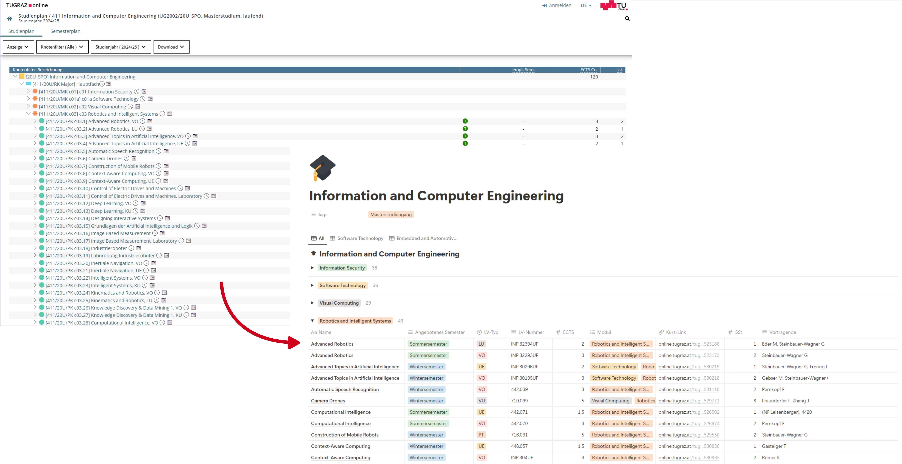

# tug2notion

Import uni courses from the uni online system to Notion using Selenium and the Notion API.

## Requirements

- [Poetry](https://python-poetry.org/docs/#installing-with-pipx) - for package management
- The public URL of the curriculum within the online system
- Active [Notion Integration](https://www.notion.so/profile/integrations) and access to the target page
- Required environment variables:
```
CURRICULUM_URL=<curriculum_url>
NOTION_SECRET=<notion_api_secret>
EXCLUDES='[<excluded nodes / modules>]'
```

## Run

Install dependencies
```shell
poetry install
```

Run
```
poetry run python src/main.py
```

## Goal

This tool was originally developed to import a single study plan within a Notion page. Therefore it is targeted for the online course management system of the TU Graz (and especially the ICE Masters program).

Online systems from other university are not tested but could work if they have the same structure (e.g. KF Graz courses seem to be working, but there could be new problems if the structure of the curricula differs too much)  

